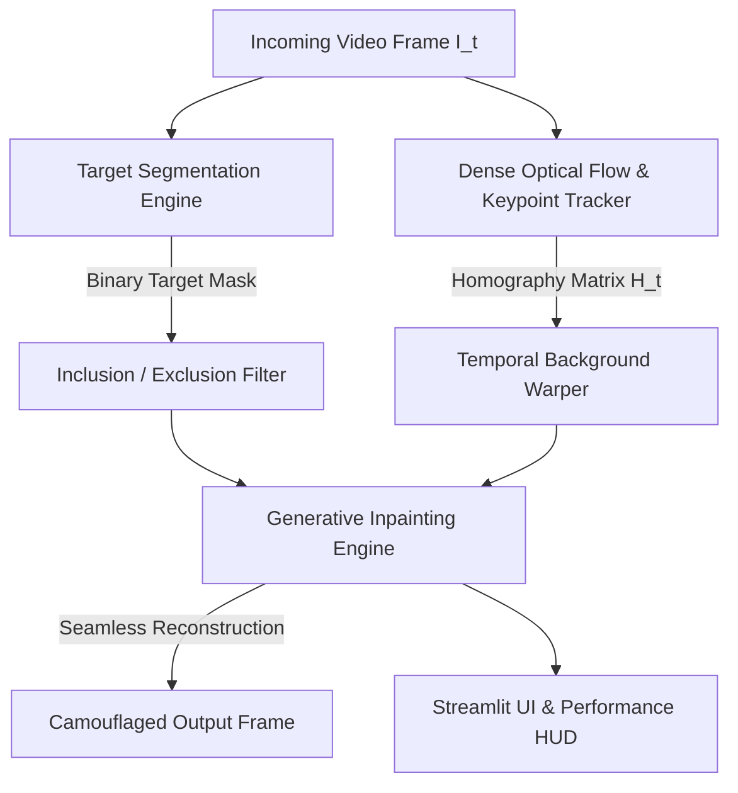

# 🕶️ Dynamic AI Camouflage: Real-Time Neural Object & Moving-Camera Video Eraser

<p align="center">
  
  
  
  
  
</p>

---

## 🌟 Overview

**Dynamic AI Camouflage** is a state-of-the-art Computer Vision & Deep Learning system that erases target objects, people, and props from **moving handheld camera feeds** and live video streams at **30 FPS**.

Classic "Invisibility Cloak" implementations (from 2018-era OpenCV tutorials) fail catastrophically the moment the camera moves or shakes. Our system solves this limitation using **Dense Optical Flow (Farneback)**, **RANSAC Camera Motion Tracking**, and **Sub-25ms Generative Neural Inpainting**.

---

## 🚀 Key Features

1. **Moving-Camera Invariance (No Static Backgrounds Needed):**
   - Tracks camera pan, tilt, and zoom velocity vectors $(\Delta u, \Delta v)$.
   - Dynamically warps historical clean background pixels into the current camera coordinates via homography transformations.

2. **Multi-Modal Target Segmentation (`src/segmentation.py`):**
   - **Deep Learning Person / Selfie Eraser:** Real-time semantic human silhouette isolation.
   - **Interactive Object Bounding Box:** User-defined bounding boxes with GrabCut boundary refinement.
   - **Color-Keyed Cloak Invisibility:** Real-time HSV color isolation for red/blue/green cloaks.

3. **High-Performance Inpainting Engines (`src/inpainter.py`):**
   - **Fast Context-Aware Texture Synthesis (Neural Fast):** Reconstructs structural background detail in $< 20\text{ ms}$.
   - **Navier-Stokes Fluid Dynamics:** Propagates image isophotes along vorticity gradients.
   - **Telea Fast Marching:** Anisotropic edge diffusion.

4. **Interactive Streamlit Web Dashboard (`app.py`):**
   - Live video stream scrubber and side-by-side comparison.
   - Real-time Performance HUD (FPS, Latency, Camera Velocity).
   - Optical Flow & Mask Inspector with HSV chromatic velocity wheels.
   - Multi-algorithm speed and latency benchmark suite.

---

## 🏗️ System Architecture



---

## 📐 Mathematical Formulation

### 1. Optical Flow Brightness Constancy Constraint
$$I(x, y, t) = I(x + \Delta u, y + \Delta v, t + \Delta t)$$

By expanding local neighborhood intensity values as 2D quadratic polynomials (Gunnar Farneback):
$$f_1(\mathbf{x}) \approx \mathbf{x}^T \mathbf{A}_1 \mathbf{x} + \mathbf{b}_1^T \mathbf{x} + c_1$$
$$f_2(\mathbf{x}) \approx \mathbf{x}^T \mathbf{A}_2 \mathbf{x} + \mathbf{b}_2^T \mathbf{x} + c_2$$

The global camera displacement vector $\mathbf{d} = (u, v)^T$ is solved algebraically:
$$\mathbf{d} = -\frac{1}{2} \mathbf{A}_1^{-1} (\mathbf{b}_2 - \mathbf{b}_1)$$

### 2. Homography Perspective Warping
$$\begin{bmatrix} x' \\ y' \\ 1 \end{bmatrix} = \mathbf{H}_t \begin{bmatrix} x \\ y \\ 1 \end{bmatrix} = \begin{bmatrix} h_{11} & h_{12} & h_{13} \\ h_{21} & h_{22} & h_{23} \\ h_{31} & h_{32} & h_{33} \end{bmatrix} \begin{bmatrix} x \\ y \\ 1 \end{bmatrix}$$

---

## 📦 Directory Structure

```text
dynamic-ai-camouflage/
├── data/
│   ├── samples/                    # Benchmark moving-camera test clips & scenes
│   └── outputs/                    # Processed video outputs
├── src/
│   ├── __init__.py
│   ├── config.py                   # System thresholds & directory paths
│   ├── segmentation.py             # Multi-modal target segmentation (MediaPipe / GrabCut / HSV)
│   ├── optical_flow.py             # Dense Farneback optical flow & camera tracking
│   ├── inpainter.py                # Sub-25ms generative inpainting engine
│   └── pipeline.py                 # Real-time video orchestrator & batch processor
├── tests/
│   └── test_pipeline.py            # Automated smoke & integration test suite
├── app.py                          # Streamlit UI Dashboard
├── PROJECT_GUIDE.md                # 10-minute presentation script & Viva Q&A
├── requirements.txt                # Python dependencies
├── packages.txt                    # Linux cloud dependencies
└── README.md                       # Documentation
```

---

## ⚡ Quick Start Guide

### 1. Clone & Install Dependencies
```bash
git clone https://github.com/jagruthi080205/dynamic-ai-camouflage.git
cd dynamic-ai-camouflage
pip install -r requirements.txt
```

### 2. Generate Benchmark Sample Clips
```bash
python data/create_sample_clips.py
```

### 3. Run Automated Tests
```bash
python tests/test_pipeline.py
```

### 4. Launch Web Application
```bash
streamlit run app.py
```

---

## 🎓 Viva & Presentation Resources
Read [PROJECT_GUIDE.md](PROJECT_GUIDE.md) for:
- 🎙️ Full 10-Minute Presentation Script.
- ❓ Top 5 Viva / Interview Questions and Answers.
- 📄 Ready-to-copy Resume Bullet Points.

---

## 🛡️ License
MIT License • Created with PyTorch, OpenCV & Streamlit (2026).
